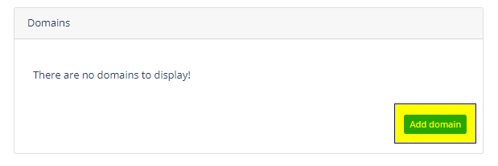

# Create a BTCP Pay Button

##  **Add Derived XPUB to BTCP Pay.**

Login to your BTCP Pay account and navigate to your Dashboard then click "Add Wallet"

Enter a Nickname for this wallet address and the Derived XPUB obtained from your wallet.

**Action:** Click Create

## **Add a Domain Name**

**Action:** Fill Out all the details

## **Create a Widget**

**Action:** Fill Out all the details

Once you are finish you will get your code to use and accept BTCP Payments.

## **Obtain the Code.**

