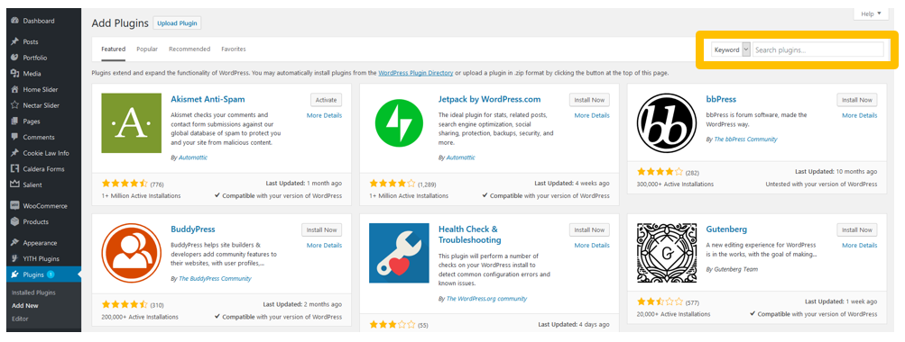

# WooCommerce

Official Repository



## Install form the WordPress plugin store

### Install & activate the plugin

Firstly login to your target WordPress site and click on `Plugins`


Next, click on `Add New`


Now, on the search bar type `btcp-pay-woocommerce`



And click on `Install Now`


Wait until you get a message that says `Activate` and then click on it.



You have now activated the BTCP Pay for WooCommerce plugin!


### Configure the plugin


Create a BTCP Pay button now if you haven't already




To configure the plugin simply paste **btcpWidget.data from your widget.** It should look something like this:

```javascript
btcpWidget.data = {
    "id"          : "btcp_widget",
    "buttonData"  : "buy_A1_6",
    "merchantid"  : "414",
    "walletid"    : "2",
    "amount"      : 0.001,
    "itemid"      : "0",
    "description" : "Pepperoni Pizza",
    "transactiondetails" :
      {
          "size"    : "12 inch",
          "crust"   : "stuffed",
          "pan"     : "thin base"
      }
```


If you want to make BTCP your store-wide currency you can do so by adding the line `"currency":  "BTCP",`  to your `btcpWidget.data`


Finally, click on save



Your plugin should now be working and BTCP Pay activated succesfully!



