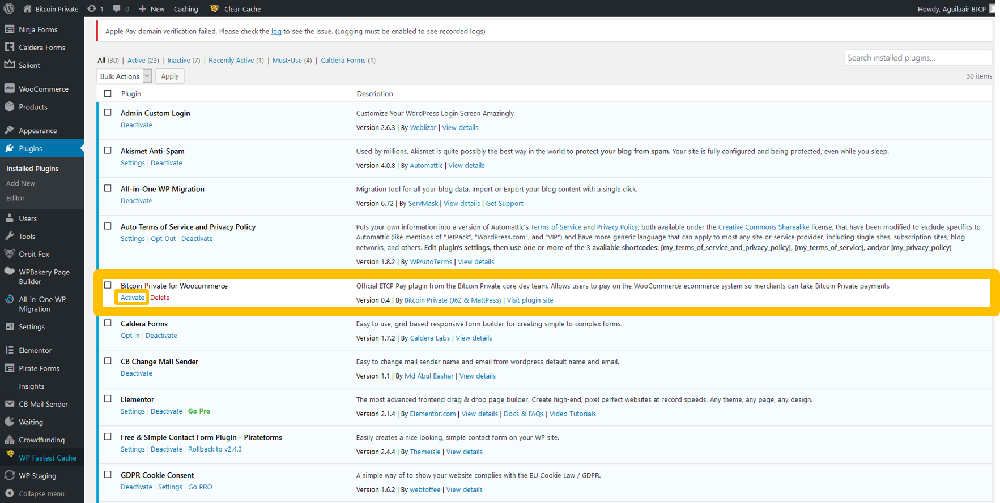

# WooCommerce

Official Repository




The plugin is still under heavy development. This guide will be updated make it easier to install in the future!

We are waiting for our plugin to get into the WordPress store!


## Downloading the plugin from GitHub


You should have registered in [BTCP Pay](https://btcppay.com) before attemping to follow the steps.


Firstly, **download** the [WooCommerce plugin](https://github.com/BTCPrivate/btcp-widget/blob/master/plugins/btcp-pay-woocommerce.php) from the official repo by clicking on **'Raw'**.


Then **right click** and click on **'Save as...'.**


Then click on **'Save'.**


You have now downloaded the BTCP Pay WooCommerce plugin!


## Uploading the plugin to WordPress

Next we will need to **upload** the plugin on WordPress.


You must have access to your website through FTP and should be confident in how to navigate directories.



Use an FTP client such as [FileZilla](https://filezilla-project.org/) or [WinSCP](https://winscp.net/eng/download.php). In this guide we will be using FileZilla.


Firstly, login to your website and navigate to your WordPress home directory.

Next go to your plugin directory, this is normally `/wp-content/plugins/`


Drag the .PHP file to the directory to upload it.



You have now uploaded the plugin to WordPress!


## Activate the plugin


You must access to you administrator account on WordPress in order to activate the plugin.


Firstly login to your target WordPress site and click on `Plugins`


Next, look for a plugin called `Bitcoin Private for WooCommerce` and click on `Acitavte`



Once you have clicked on activate the website will redirect you directly you the configuration page.


Create a BTCP Pay button now if you haven't already




## Configure the plugin

To configure the plugin simply paste **btcpWidget.data from your widget.** It should look something like this:

```javascript
btcpWidget.data = {
    "id"          : "btcp_widget",
    "buttonData"  : "buy_A1_6",
    "merchantid"  : "414",
    "walletid"    : "2",
    "amount"      : 0.001,
    "itemid"      : "0",
    "description" : "Pepperoni Pizza",
    "transactiondetails" :
      {
          "size"    : "12 inch",
          "crust"   : "stuffed",
          "pan"     : "thin base"
      }
```


If you want to make BTCP your store-wide currency you can do so by adding the line `"currency":  "BTCP",`  to your `btcpWidget.data`


Finally, click on save



Your plugin should now be working and BTCP Pay activated succesfully!



