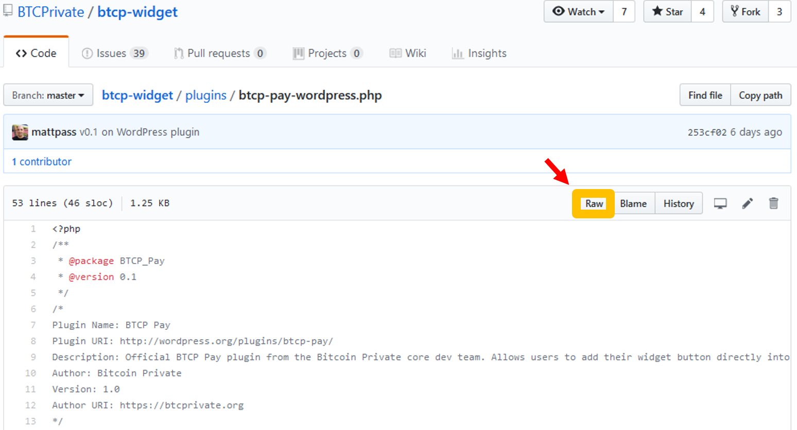
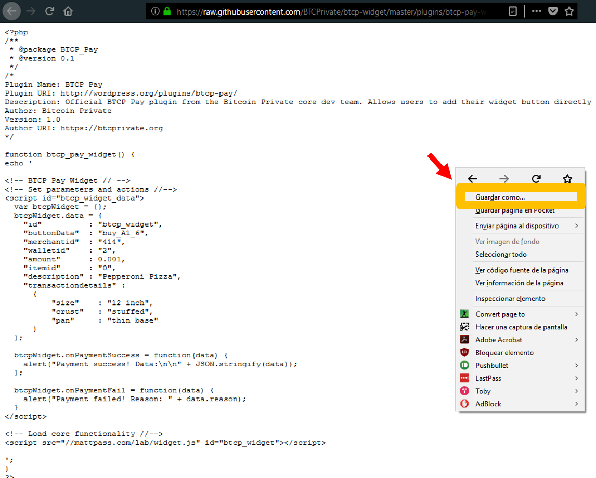
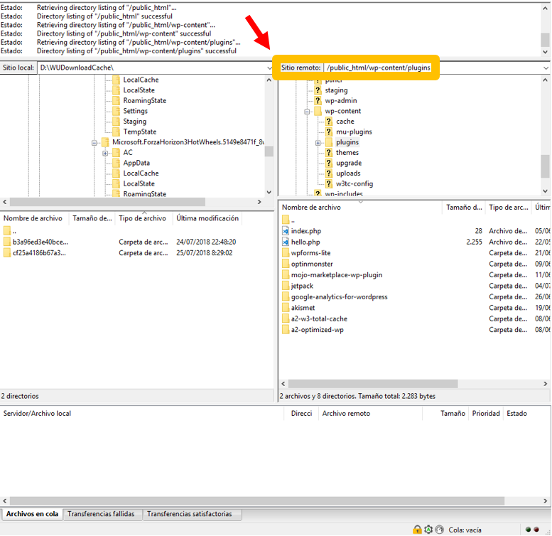
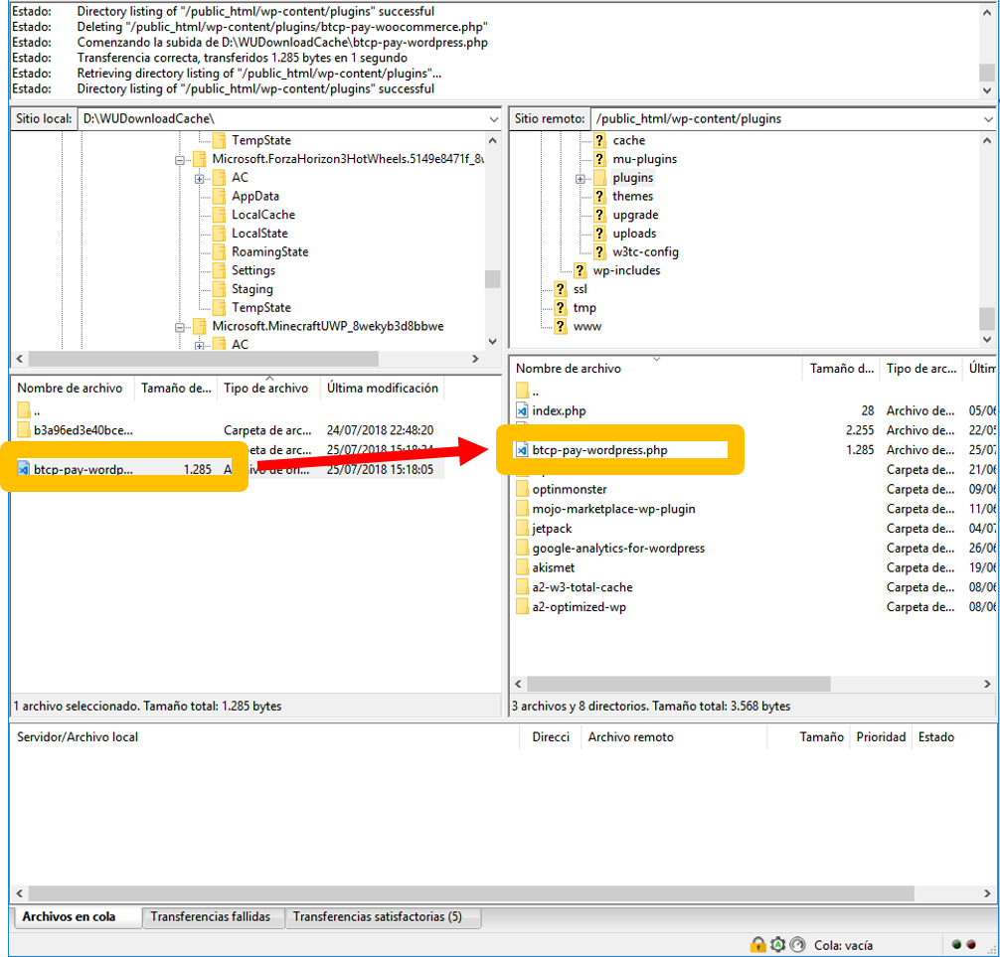
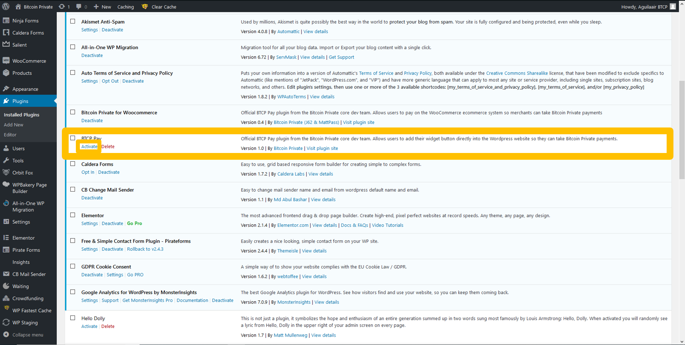

# Wordpress

Official Repository




The WordPress plugin is **not complete**, therefore the plugin is not functional **yet**.


## Downloading the plugin from GitHub


You should have registered in [BTCP Pay](https://btcppay.com) before attempting to follow the steps.


Firstly, **download** the [WordPress plugin](https://github.com/BTCPrivate/btcp-widget/blob/master/plugins/btcp-pay-wordpress.php) from the official repo by clicking on **'Raw'**.

Then **right click** and click on **'Save as...'.**

Then click on **'Save'.**

## Uploading the plugin to WordPress

Next we will need to **upload** the plugin on WordPress.


You must have access to your website through FTP and should be confident in how to navigate directories.



Use an FTP client such as [FileZilla](https://filezilla-project.org/) or [WinSCP](https://winscp.net/eng/download.php)


Firstly, login to your website and navigate to your WordPress home directory.

Next go to your plugin directory, this is normally `/wp-content/plugins/`

Drag the .PHP file to the directory to upload it.

You have now uploaded the plugin to WordPress!

## Activate the plugin


You must access to you administrator account on WordPress in order to activate the plugin.


Firstly login to your target WordPress site and click on `Plugins`

Next, look for a plugin called `Bitcoin Private for WooCommerce` and click on `Acitavte`


Complete docs coming soon!


