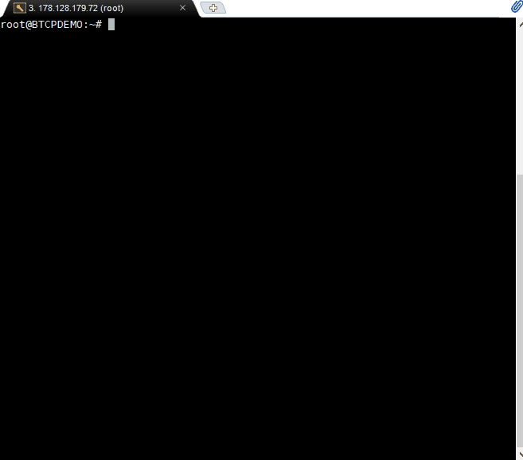
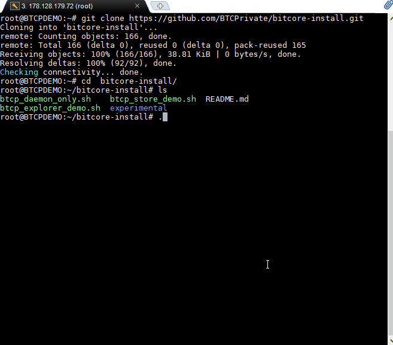

# BTCP Store Server Installation

## Clone the BTCP Bitcore installer

```text
git clone https://github.com/BTCPrivate/bitcore-install.git
cd bitcore-install
```



## Run the installer

The installer will install everything you need to run the store demo application which will provide everything needed for the Widget to run. 

```text
./btcp_store_demo.sh
```



Once everything is finished you should be ready to do a few tests to make sure everything is running properly.

