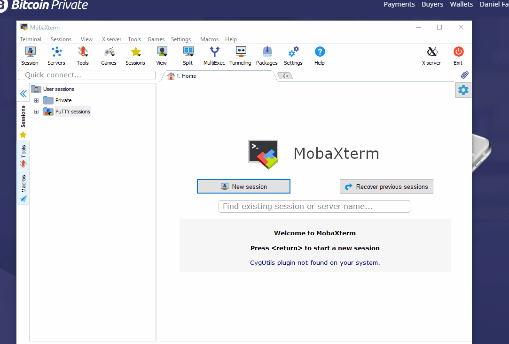

# Connecting to your Server

## Copy the IP from your Droplet

## Connect using your favorite SSH Terminal. 

For this example we will use [MobaXterm](https://mobaxterm.mobatek.net/download.html) on Windows. Start a new SSH session, enter the IP, username \(root\) and load your key. Then enter your passphrase from the previous step when asked. You are now logged in to your Digital Ocean Droplet.


You have now succesfully connected to the droplet.


