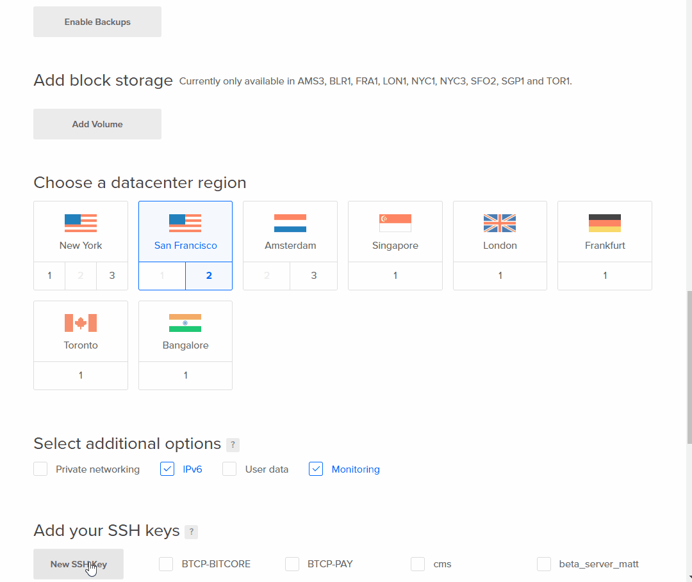

# Digital Ocean Server Setup

## Creating a new Droplet

Login to your Digital Ocean account and click create then select Droplet. 


Choose an Image. BTCP is currently optimize to run on Ubuntu with 2 GB of memory for $10/month. 


  
Choose a location closer to where most of your buyers are from.


  
Select IPv6 and Monitoring. 


## Add your SSH Key to allow remote login to this server. 

If you don't have a public SSH key on your computer you can generate one using the following tools: 



```text
ssh-keygen
```



Download Git  
  
 "**Git bash** " is a msys shell included in "Git for Windows" software. It will allow you to generate pairs of public and private keys to be used to login to your Droplet. 

Download GIT from here:



## RUNNING PUTTYGEN

 Go to Windows **Start menu**  type Git Bash


  
Run the following command and follow the prompts

```text
 ssh-keygen
```


Enter a name for your keys, then enter a passphrase, they will be saved on your user folder  ~/  by default. Its a good practice to move them to  ~/.ssh

Copy the Public key \(The file that ends in .pub\) will be required for the next step. 


Public key is the shorter one. Starts with ssh-rsa








## Add your SSH Key

Add your SSH key from the previous step. 



## Finalize

Enter a name and create click create


